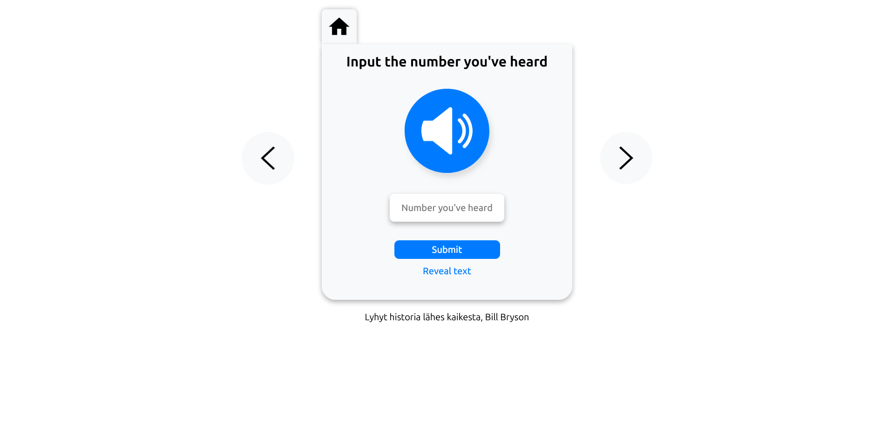

# Finnish Numbers Listening Comprehension

Welcome to the Finnish Numbers Listening Comprehension website! This simple yet effective tool is designed to help improve your Finnish number recognition and listening comprehension skills.

## 🌟 Features
- Practice Listening: Listen to short sentences containing Finnish numbers.
- Input Your Answer: Test your comprehension by typing what you heard.
- Immediate Feedback: Check your results and track your progress.
- Simple & Lightweight: Built with Vanilla JavaScript for a fast and seamless experience.

## 🚀 Technologies Used
- HTML: Structuring the web pages.
- CSS: Styling the user interface.
- JavaScript: Logic for audio playback, input validation, and feedback.

## 🎯 How to Use
- Open the website.
- Click on the "Play" button to listen to a sentence.
- Type what you heard in the input field.
- Submit your answer to see if you're correct.
- Repeat and improve your listening skills!

## Screenshots

## Live
https://available-username-it-is.github.io/finnish-numbers/index.html
